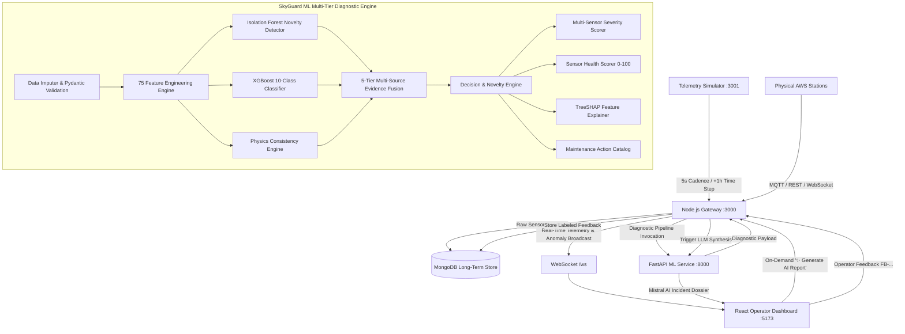

# SkyGuard AI --- Intelligent Real-Time AWS Sensor Anomaly Detection

## 1. Project Overview

**SkyGuard AI** is an end-to-end intelligent monitoring platform for
Automatic Weather Stations (AWS). It continuously analyzes temperature,
relative humidity, and atmospheric pressure readings to detect sensor
anomalies, identify likely root causes, explain model decisions,
estimate sensor health, assign operational severity, and generate
operator-friendly maintenance reports.

The platform combines **machine learning, physics-based consistency
rules, temporal analysis, spatial analysis, explainable AI, real-time
communication, a database-backed backend, and an LLM reporting layer**.

### Core technology stack

-   **Machine Learning:** Isolation Forest + XGBoost
-   **ML API:** Python + FastAPI
-   **Validation:** Pydantic
-   **Explainability:** SHAP
-   **Physics Intelligence:** Meteorological consistency engine
-   **LLM:** Mistral AI
-   **Backend:** Node.js
-   **Real-time ingestion:** MQTT
-   **Real-time dashboard updates:** WebSocket
-   **Database:** MongoDB
-   **Frontend:** React

------------------------------------------------------------------------

## 2. Problem Solved

Automatic Weather Stations continuously generate sensor readings. Sensor
failures, calibration problems, frozen values, drift, offsets,
communication problems, and physically inconsistent measurements can
reduce the reliability of weather observations.

SkyGuard AI is designed to:

-   Detect abnormal temperature, humidity, and pressure observations.
-   Distinguish normal observations from known and potentially novel
    anomalies.
-   Classify the likely root cause of an anomaly.
-   Compare current observations with historical behavior.
-   Compare a station with nearby or clustered stations.
-   Check whether measurements are physically and meteorologically
    consistent.
-   Explain why the ML classifier produced a diagnosis.
-   Assign anomaly severity.
-   Calculate a sensor health score.
-   Recommend maintenance actions.
-   Convert technical evidence into operator-friendly reports using
    Mistral AI.
-   Stream results to a real-time dashboard.
-   Collect operator feedback for future model improvement.

------------------------------------------------------------------------

### 3. End-to-End Working Pipeline & Architecture

### System Topology Diagram



### Complete End-to-End Flow

``` text
Automatic Weather Station / Simulator (:3001)
          │
          ▼
Temperature / Humidity / Pressure Readings
          │
          ▼
      MQTT / HTTP Ingestion
          │
          ▼
    Node.js API Gateway (:3000)
          │
          ├──────────────► MongoDB (Raw Historical Telemetry)
          │
          ▼
     FastAPI ML Service (:8000)
          │
          ▼
   Pydantic Schema Validation
          │
          ▼
   75 Feature Engineering Engine (Lags, Rolling, Spatial, Physics)
          │
     ┌────┴───────────────┐
     │                    │
     ▼                    ▼
Isolation Forest       XGBoost (10-Class)
     │                    │
     └─────────┬──────────┘
               │
        Physics Consistency Rules (Magnus-Tetens, Rate Bounds)
               │
        Temporal Evidence (Rolling Z-Scores, Frozen Counts)
               │
         Spatial Evidence (Cluster Deviation, Neighbor Z-Scores)
               │
               ▼
        5-Tier Evidence Fusion Engine
               │
               ▼
        Decision Engine (Normal / Known / Novel Anomaly)
               │
               ▼
        Root-Cause Diagnosis (Confidence & Failure Mode)
               │
               ▼
        TreeSHAP Signed Feature Explanations
               │
               ▼
      Operational Severity (LOW / MEDIUM / HIGH / CRITICAL) + Health (0–100)
               │
               ▼
      Structured ML Diagnostic Payload
               │
               ▼
          Node.js Gateway
               │
       ┌───────┴────────┐
       ▼                ▼
    MongoDB          WebSocket (/ws)
  (Analyses/Alerts)     │
                        ▼
                 React Dashboard (:5173)
                        │
                        ├──────────────────────────┐
                        ▼                          ▼
                 On-Demand AI Report        Operator Feedback
                 (Mistral AI Synthesis)     (Stored in MongoDB for
                                            Active Learning Retraining)
```

------------------------------------------------------------------------

## 4. Real-Time Weather Data Ingestion

SkyGuard accepts telemetry generated by an AWS.

Typical incoming data includes:

-   Station ID
-   Station name
-   City/region
-   Station cluster
-   Timestamp
-   Latitude
-   Longitude
-   Temperature in °C
-   Relative humidity in %
-   Atmospheric pressure in hPa

### MQTT

MQTT provides a lightweight mechanism for transmitting telemetry from
stations or simulated station publishers to the Node.js backend.

### WebSocket

WebSocket is used between the backend and React dashboard to push new
readings, anomaly results, health changes, and alerts without requiring
continuous page refreshes.

------------------------------------------------------------------------

## 5. Pydantic Input Validation

FastAPI uses Pydantic schemas before telemetry enters the ML pipeline.

Validation can include:

-   Required field checks
-   Correct data types
-   Station identifier validation
-   Timestamp parsing
-   Latitude/longitude validation
-   Temperature validation
-   Relative humidity validation
-   Pressure validation
-   Missing-value handling
-   Rejection of malformed requests

This prevents invalid API data from silently entering the ML inference
pipeline.

------------------------------------------------------------------------

## 6. Feature Engineering

SkyGuard converts raw sensor readings into a much richer representation
for anomaly detection and classification.

### 6.1 Time Features

Examples include:

-   Hour
-   Day
-   Day of week
-   Month
-   Hour sine
-   Hour cosine
-   Month sine
-   Month cosine

Cyclical sine/cosine representations help represent repeating time
patterns without treating the end and beginning of a cycle as unrelated.

### 6.2 Lag Features

For temperature, humidity, and pressure:

-   Lag 1
-   Lag 24
-   Difference from lag 1
-   Difference from lag 24

These features allow the model to compare the current reading with
earlier station behavior.

### 6.3 Rate-of-Change Features

Examples:

-   Temperature rate per hour
-   Humidity rate per hour
-   Pressure rate per hour

Sudden changes can be strong evidence of sensor faults or unusual
conditions.

### 6.4 Rolling Features

For each primary sensor, SkyGuard can use:

-   6-period rolling median
-   6-period rolling mean
-   6-period rolling variance
-   24-period rolling mean
-   24-period rolling standard deviation
-   24-period rolling difference
-   24-period rolling z-score

These features provide short-term and longer-term context.

### 6.5 Frozen-Value Features

Frozen-count features identify readings that remain unchanged for
suspiciously long periods.

This is useful for detecting sensors that are stuck at a constant value.

------------------------------------------------------------------------

## 7. Spatial Intelligence

SkyGuard does not need to treat each station as an isolated device. A
station can be compared with nearby stations or stations belonging to
the same geographic/meteorological cluster.

Spatial features include:

-   Cluster temperature mean
-   Cluster temperature standard deviation
-   Cluster pressure mean
-   Cluster pressure standard deviation
-   Cluster humidity mean
-   Cluster humidity standard deviation
-   Spatial temperature difference
-   Spatial temperature z-score
-   Spatial pressure difference
-   Spatial pressure z-score
-   Spatial humidity difference
-   Spatial humidity z-score
-   Neighbor deviation score
-   Station-neighbor consistency
-   Cluster anomaly percentage

### Why spatial intelligence matters

If one station reports a major temperature jump while surrounding
stations remain stable, the evidence points more strongly toward a local
sensor problem.

If many nearby stations change together, the change may instead
represent a genuine weather event.

------------------------------------------------------------------------

## 8. Cross-Sensor and Meteorological Features

SkyGuard also derives relationships between sensors.

Examples include:

-   Temperature/pressure ratio
-   Temperature/humidity ratio
-   Humidity/pressure ratio
-   Dew point
-   Dew-point depression
-   Vapor-pressure ratio

These features help identify combinations that may look individually
valid but are inconsistent when considered together.

------------------------------------------------------------------------

## 9. Physics Consistency Engine

The physics engine provides deterministic evidence independent of the ML
models.

It checks whether observations are physically or operationally
plausible.

### 9.1 Range Checks

Checks whether:

-   Temperature is within expected operational limits.
-   Humidity is within expected limits.
-   Pressure is within expected limits.

### 9.2 Rate Checks

Checks whether:

-   Temperature changes too rapidly.
-   Humidity changes too rapidly.
-   Pressure changes too rapidly.

### 9.3 Dew-Point Consistency

The engine evaluates dew-point depression and related
temperature/humidity consistency.

### 9.4 Cross-Sensor Checks

The engine can flag suspicious combinations involving multiple sensors,
such as extreme temperature combined with extreme humidity.

### Physics evidence outputs

-   `physics_range_score`
-   `physics_rate_score`
-   `physics_dewpoint_score`
-   `physics_cross_score`
-   `physics_evidence_score`

### Physics severity bins

``` text
0.00 → Nominal
0.25 → Minor
0.50 → Moderate
0.75 → High
1.00 → Critical
```

The score increases as physical inconsistency becomes stronger.

------------------------------------------------------------------------

## 10. Isolation Forest --- Novelty Detection

Isolation Forest provides an unsupervised anomaly signal.

Its purpose is different from the XGBoost classifier.

### Role

Isolation Forest answers:

> Does this observation look unusual compared with the patterns learned
> from the reference data?

### Benefits

-   Unsupervised anomaly detection
-   Novelty detection
-   Independent evidence source
-   Ability to flag unusual patterns that may not cleanly belong to a
    predefined root-cause class

This helps SkyGuard avoid relying entirely on known supervised anomaly
classes.

------------------------------------------------------------------------

## 11. XGBoost --- Root-Cause Classification

XGBoost is the supervised root-cause classifier.

The project uses the following 10 classes:

1.  `normal`
2.  `temperature_spike`
3.  `humidity_spike`
4.  `pressure_jump`
5.  `freeze`
6.  `drift`
7.  `offset`
8.  `missing_data`
9.  `multivariate_inconsistency`
10. `spatial_inconsistency`

### XGBoost provides

-   Root-cause prediction
-   Class probabilities
-   Prediction confidence
-   Known anomaly classification
-   Multivariate pattern recognition

Isolation Forest and XGBoost therefore serve complementary roles:

``` text
Isolation Forest → "Is this unusual?"
XGBoost          → "What known root cause does it resemble?"
```

------------------------------------------------------------------------

## 12. Temporal Anomaly Evidence

Temporal evidence measures whether a station is behaving abnormally
relative to its own recent history.

It can use:

-   Lag differences
-   Rates of change
-   Rolling statistics
-   Rolling z-scores
-   Frozen counts
-   Persistence of abnormal values

This makes the system sensitive to anomalies that cannot be identified
reliably from one isolated measurement.

------------------------------------------------------------------------

## 13. Spatial Anomaly Evidence

Spatial evidence evaluates whether a station is inconsistent with its
neighbors or cluster.

It can use:

-   Spatial differences
-   Spatial z-scores
-   Neighbor deviation
-   Cluster statistics
-   Neighbor consistency
-   Percentage of anomalous stations in the cluster

This is especially important for separating a single-station sensor
fault from a wider environmental event.

------------------------------------------------------------------------

## 14. Multi-Evidence Anomaly Detection

A major SkyGuard feature is that the final diagnosis is not based on one
model alone.

The system combines:

``` text
Isolation Forest Evidence
          +
Temporal Evidence
          +
Spatial Evidence
          +
Physics Evidence
          +
XGBoost Evidence
          │
          ▼
    Evidence Fusion
```

This hybrid architecture combines:

-   Unsupervised ML
-   Supervised ML
-   Temporal reasoning
-   Spatial reasoning
-   Deterministic physics rules

------------------------------------------------------------------------

## 15. Evidence Fusion Engine

The evidence fusion layer converts multiple signals into a unified
anomaly score.

Typical inputs include:

-   Isolation Forest score
-   XGBoost anomaly evidence
-   Temporal evidence
-   Spatial evidence
-   Physics evidence

Output:

-   Fused anomaly score

### Advantages

-   Reduces dependence on one model.
-   Allows independent evidence sources to reinforce one another.
-   Makes anomaly decisions more robust.
-   Supports known and novel anomaly reasoning.
-   Incorporates domain knowledge alongside ML.

------------------------------------------------------------------------

## 16. Decision Engine

The decision engine converts the fused evidence and classifier
information into an operational decision.

Conceptually:

``` text
              Evidence
                 │
                 ▼
           Decision Engine
                 │
        ┌────────┼─────────┐
        ▼        ▼         ▼
     NORMAL    KNOWN     NOVEL
              ANOMALY   ANOMALY
```

### Normal

Evidence indicates that the station is behaving normally.

### Known anomaly

Evidence indicates an anomaly and XGBoost identifies a known root-cause
category.

### Novel anomaly

The observation appears abnormal but may not confidently fit one of the
known supervised classes.

------------------------------------------------------------------------

## 17. Root-Cause Diagnosis

Instead of producing only:

``` text
Anomaly detected
```

SkyGuard can produce:

``` text
Decision: anomaly
Root cause: temperature_spike
Confidence: 0.94
```

Root-cause diagnosis is more useful to maintenance teams because
different faults require different actions.

------------------------------------------------------------------------

## 18. SHAP Explainable AI

SHAP is used to explain which features contributed most strongly to the
XGBoost diagnosis.

Example:

``` text
Diagnosis: temperature_spike

Top contributors:
temperature_c             +0.420
spatial_temp_zscore       +0.310
temperature_c_rate_1h     +0.180
dewpoint_depression_c     +0.090
```

### SHAP features

-   Feature-level explanations
-   Top-K contributing features
-   Signed contribution values
-   Human-readable explanation text
-   Model transparency for operators

### Why it matters

Without explainability:

``` text
Model → temperature_spike
```

With explainability:

``` text
Model → temperature_spike
          │
          ├─ unusually high temperature
          ├─ high temperature rate
          ├─ deviation from nearby stations
          └─ supporting meteorological features
```

This makes the diagnosis easier to verify and trust.

------------------------------------------------------------------------

## 19. Severity Engine

After detecting an anomaly, SkyGuard determines its operational
severity.

Possible levels include:

-   `LOW`
-   `MEDIUM`
-   `HIGH`
-   `CRITICAL`

The severity engine can consider:

-   Fused anomaly strength
-   Classification confidence
-   Persistence
-   Physics inconsistency
-   Multi-sensor evidence
-   Root-cause type

Severity helps operators prioritize incidents.

------------------------------------------------------------------------

## 20. Sensor Health Score

SkyGuard summarizes sensor condition with a health score from 0 to 100.

Conceptually:

``` text
100 → Excellent / healthy
 75 → Good
 50 → Warning
 25 → Poor
  0 → Critical
```

Potential deductions include:

-   Anomaly severity penalty
-   Drift/offset penalty
-   Missing/dropout penalty
-   Physics inconsistency penalty

### Why health scoring is useful

A single anomaly is an event.

A health score provides a simpler long-term operational view of the
station or sensor.

------------------------------------------------------------------------

## 21. Automated Maintenance Recommendation

SkyGuard converts diagnosis into an actionable maintenance
recommendation.

Example:

``` text
Root cause:
temperature_spike

Severity:
HIGH

Engineering priority:
HIGH

Recommended action:
Inspect the temperature sensor, verify calibration,
and compare the sensor against a reference instrument.
```

This moves the system beyond anomaly detection toward decision support.

------------------------------------------------------------------------

## 22. Mistral AI Reporting Layer

Mistral AI operates after the deterministic ML pipeline has generated
structured evidence.

Input can include:

-   Station information
-   Telemetry
-   Root cause
-   Confidence
-   Fused anomaly score
-   Isolation Forest evidence
-   XGBoost evidence
-   Physics evidence
-   Temporal evidence
-   Spatial evidence
-   SHAP factors
-   Severity
-   Sensor health
-   Maintenance recommendation

The LLM then produces an operator-friendly diagnostic report.

### Mistral AI capabilities

-   Summarize the incident
-   Explain the likely root cause
-   Describe important evidence
-   Explain sensor health
-   Present maintenance recommendations
-   Convert technical model output into readable operational language

### Important design principle

``` text
ML + Physics → Diagnosis
LLM          → Communication of diagnosis
```

The LLM is a reporting layer rather than the sole authority for anomaly
detection.

------------------------------------------------------------------------

## 23. FastAPI ML Service

FastAPI exposes the ML pipeline as an application service.

Recommended public endpoints:

``` text
GET  /api/health
POST /api/analyze
```

The main analysis endpoint can perform the entire pipeline:

``` text
Request
  ↓
Pydantic
  ↓
Feature Engineering
  ↓
Isolation Forest
  ↓
XGBoost
  ↓
Physics
  ↓
Temporal + Spatial
  ↓
Fusion
  ↓
Decision
  ↓
SHAP
  ↓
Severity
  ↓
Health
  ↓
Mistral Report
  ↓
Response
```

Keeping these operations behind one analysis endpoint simplifies
integration with Node.js and React.

------------------------------------------------------------------------

## 24. Node.js Backend

Node.js serves as the application and real-time orchestration layer.

Responsibilities include:

-   Receive MQTT telemetry
-   Route incoming station messages
-   Communicate with FastAPI
-   Persist telemetry to MongoDB
-   Persist anomaly results
-   Persist reports
-   Manage WebSocket connections
-   Broadcast real-time updates to React
-   Expose frontend-facing APIs
-   Receive operator feedback
-   Handle application errors and logging

This keeps ML responsibilities in Python while application/network
responsibilities remain in Node.js.

------------------------------------------------------------------------

## 25. MongoDB Data Storage

MongoDB provides centralized storage for operational and historical
data.

### Telemetry collection

Can contain:

-   Station ID
-   Timestamp
-   Temperature
-   Humidity
-   Pressure
-   Location
-   Cluster

### Analysis collection

Can contain:

-   Decision
-   Root cause
-   Confidence
-   Severity
-   Health score
-   Fused anomaly score
-   Evidence scores
-   SHAP factors

### Report collection

Can contain:

-   Diagnostic report
-   Maintenance priority
-   Recommended action
-   LLM source
-   Report timestamp

### Feedback collection

Can contain:

-   Analysis ID
-   Station ID
-   Operator decision
-   Corrected root cause
-   Comment
-   Operator ID
-   Validation status
-   Retraining status

------------------------------------------------------------------------

## 26. React Dashboard

The React dashboard presents technical results in a form suitable for
operators.

### Live Telemetry

-   Current temperature
-   Current humidity
-   Current pressure
-   Last update time
-   Station connectivity/status

### Station Overview

-   Station ID
-   Station name
-   City
-   Cluster
-   Latitude/longitude
-   Current health status

### Sensor Health

-   0--100 health score
-   Health status
-   Health deductions
-   Historical health trend

### Anomaly Summary

-   Current anomaly status
-   Root cause
-   Confidence
-   Severity
-   Fused anomaly score

### Evidence Panel

Can display:

-   Isolation Forest evidence
-   XGBoost evidence
-   Physics evidence
-   Temporal evidence
-   Spatial evidence

### SHAP Explainability

Can display:

-   Top contributing features
-   SHAP values
-   Human-readable feature contribution statements

### Anomaly Map

Can show:

-   AWS station locations
-   Normal stations
-   Anomalous stations
-   Severity
-   Regional/cluster anomaly patterns

### Timeline and Charts

Can visualize:

-   Temperature history
-   Humidity history
-   Pressure history
-   Anomaly timeline
-   Sensor health trend

### AI Diagnostic Report

Displays the Mistral-generated report containing:

-   Incident summary
-   Evidence analysis
-   Health assessment
-   Maintenance recommendation
-   Operator-oriented explanation

------------------------------------------------------------------------

## 27. Real-Time WebSocket Dashboard

WebSocket enables immediate UI updates.

``` text
AWS
 │
 ▼
MQTT
 │
 ▼
Node.js
 │
 ▼
FastAPI Analysis
 │
 ▼
MongoDB
 │
 ▼
WebSocket
 │
 ▼
React Dashboard
```

When a new station reading is processed, the dashboard can update
automatically.

------------------------------------------------------------------------

## 28. Operator Feedback

SkyGuard supports a human-in-the-loop feedback process.

After reviewing a diagnosis, an operator can mark it as:

-   Confirmed
-   False alarm
-   Corrected

The operator may also provide:

-   Corrected root cause
-   Comment
-   Operator ID

Example flow:

``` text
SkyGuard Diagnosis
       │
       ▼
React Dashboard
       │
       ▼
Operator Review
       │
       ├── Confirm
       ├── False Alarm
       └── Correct
              │
              ▼
      POST /api/feedback
              │
              ▼
           Node.js
              │
              ▼
           MongoDB
```

------------------------------------------------------------------------

## 29. Human-in-the-Loop Model Improvement

Operator feedback should not automatically retrain the model
immediately.

A safer pipeline is:

``` text
Operator Feedback
       │
       ▼
Pending Validation
       │
       ▼
Verified / Golden Label
       │
       ▼
Evaluation Dataset
       │
       ▼
Model Retraining
       │
       ▼
Validation
       │
       ▼
New Model Version
```

This prevents incorrect operator feedback from directly contaminating
training data.

------------------------------------------------------------------------

## 30. Model and Metadata Management

Production inference uses model artifacts such as:

``` text
models/
├── isolation_forest_model.joblib
└── xgboost_classifier.joblib
```

Pipeline configuration is stored in:

``` text
metadata/
└── pipeline_metadata.json
```

Metadata can define the inference contract, including:

-   Feature names
-   Feature order
-   Root-cause classes
-   Thresholds
-   Physics configuration
-   Fusion configuration
-   Severity configuration
-   Health configuration

Keeping the feature contract in metadata helps ensure that inference
uses the same feature order expected by trained models.

------------------------------------------------------------------------

## 31. Separation of Responsibilities

The architecture deliberately separates responsibilities.

### FastAPI

``` text
ML + Physics + Explainability
```

Responsible for:

-   Validation
-   Feature engineering
-   ML inference
-   Physics checks
-   Evidence fusion
-   Decision
-   SHAP
-   Severity
-   Health
-   Structured diagnosis

### Mistral AI

``` text
Reporting
```

Responsible for:

-   Natural-language explanation
-   Summary
-   Maintenance report

### Node.js

``` text
Application + Real-Time Gateway
```

Responsible for:

-   MQTT
-   MongoDB
-   WebSocket
-   API orchestration
-   Frontend communication

### React

``` text
Presentation
```

Responsible for:

-   Dashboard
-   Charts
-   Maps
-   Alerts
-   Diagnosis display
-   Feedback UI

------------------------------------------------------------------------

## 32. Compact Frontend Payload

The React dashboard does not need the entire internal engineered feature
vector.

A compact response can contain:

-   Station information
-   Timestamp
-   Raw telemetry
-   Anomaly decision
-   Root cause
-   Confidence
-   Severity
-   Fused anomaly score
-   Health score
-   Evidence scores
-   Top SHAP factors
-   Maintenance recommendation
-   LLM report

The detailed lag, rolling, cluster, ratio, and other model features can
remain internal to FastAPI and MongoDB where required.

This reduces network payload and keeps frontend logic simple.

------------------------------------------------------------------------

## 33. Key Innovation --- Hybrid Intelligence

SkyGuard is not only an ML classifier.

It combines several forms of intelligence:

``` text
                    SKYGUARD AI
                         │
        ┌────────────────┼────────────────┐
        │                │                │
        ▼                ▼                ▼
 Machine Learning   Domain Physics   Context
        │                │                │
 ┌──────┴─────┐          │        ┌───────┴───────┐
 ▼            ▼          ▼        ▼               ▼
Isolation   XGBoost   Physics   Temporal        Spatial
Forest                Rules    Analysis        Analysis
 └───────────────┬────────┴─────────┬──────────────┘
                 │                  │
                 └────────┬─────────┘
                          ▼
                   Evidence Fusion
                          │
                          ▼
                     Diagnosis
                          │
                          ▼
                        SHAP
                          │
                          ▼
                  Mistral Reporting
```

------------------------------------------------------------------------

## 34. Major Project Differentiators / USP

### 1. Multi-model anomaly detection

Uses both supervised and unsupervised ML rather than depending on one
algorithm.

### 2. Known + novel anomaly handling

XGBoost handles known root causes while Isolation Forest provides
novelty evidence.

### 3. Physics-aware AI

Meteorological consistency rules validate the plausibility of
measurements.

### 4. Temporal intelligence

The current reading is compared with the station's historical behavior.

### 5. Spatial intelligence

The station is compared with nearby/cluster stations.

### 6. Evidence fusion

Independent signals are combined into a single anomaly assessment.

### 7. Root-cause classification

The system identifies *what type* of problem occurred instead of only
raising an anomaly flag.

### 8. Explainable AI

SHAP shows which features influenced the classifier.

### 9. Sensor health score

Provides a simple 0--100 operational indicator.

### 10. Severity prioritization

Categorizes anomalies from low to critical.

### 11. Maintenance recommendations

Converts diagnosis into operational actions.

### 12. Mistral AI reporting

Transforms structured technical evidence into operator-friendly
language.

### 13. Real-time MQTT architecture

Supports continuous AWS telemetry ingestion.

### 14. Real-time WebSocket dashboard

Pushes results to the frontend immediately.

### 15. MongoDB historical storage

Supports telemetry history, analysis history, reports, and feedback.

### 16. Human-in-the-loop feedback

Operators can confirm or correct AI results.

### 17. Model improvement pipeline

Validated feedback can become future training data.

### 18. Sensor fault vs environmental event reasoning

Temporal, spatial, physics, and ML evidence together provide better
context for distinguishing local sensor problems from broader weather
changes.

### 19. Modular architecture

FastAPI, Node.js, MongoDB, Mistral AI, and React have clearly separated
responsibilities.

### 20. End-to-end operational pipeline

The project covers the complete path from raw station telemetry to
diagnosis, explanation, maintenance recommendation, visualization, and
feedback.

------------------------------------------------------------------------

## 35. Suggested PPT Feature Summary

For a concise innovation slide:

``` text
SkyGuard AI
│
├── Real-Time AWS Monitoring
├── MQTT Telemetry Ingestion
├── Pydantic Data Validation
├── Advanced Feature Engineering
│
├── Isolation Forest
│   └── Novel Anomaly Detection
│
├── XGBoost
│   └── 10-Class Root-Cause Classification
│
├── Temporal Intelligence
├── Spatial Neighbor Intelligence
├── Physics Consistency Engine
│
├── Multi-Evidence Fusion
├── Known / Novel Anomaly Decision
│
├── SHAP Explainable AI
├── Severity Classification
├── 0–100 Sensor Health Score
├── Maintenance Recommendations
│
├── Mistral AI Diagnostic Reports
│
├── Node.js Backend
├── MongoDB
├── MQTT + WebSocket
├── React Real-Time Dashboard
│
└── Operator Feedback
    └── Validated Model Improvement
```

------------------------------------------------------------------------

## 36. One-Line Project Description

> **SkyGuard AI is a real-time, physics-aware and explainable AI
> platform that combines Isolation Forest, XGBoost, temporal-spatial
> intelligence, evidence fusion, SHAP, sensor-health scoring and Mistral
> AI to detect, diagnose, explain and report anomalies in Automatic
> Weather Station sensors.**

------------------------------------------------------------------------

## 37. Final System Summary

SkyGuard AI provides a complete anomaly-management lifecycle:

``` text
SENSE
  ↓
VALIDATE
  ↓
UNDERSTAND CONTEXT
  ↓
DETECT
  ↓
CLASSIFY
  ↓
VERIFY WITH PHYSICS
  ↓
FUSE EVIDENCE
  ↓
DECIDE
  ↓
EXPLAIN
  ↓
ASSESS HEALTH
  ↓
PRIORITIZE
  ↓
RECOMMEND
  ↓
REPORT
  ↓
VISUALIZE
  ↓
COLLECT FEEDBACK
  ↓
IMPROVE
```

The result is not simply an anomaly detector. It is an **end-to-end intelligent sensor-health and diagnostic platform for Automatic Weather Stations**.

------------------------------------------------------------------------

## 38. On-Demand Generative AI Incident Dossiers

Unlike traditional architectures that continuously invoke large language models on every incoming packet—wasting computational resources and API credits—SkyGuard AI utilizes a high-performance **On-Demand Generative AI Reporting Layer** (`POST /api/generate-report`).

### Operational Workflow:
1. **Background Ingestion & ML Scoring**: The 5-second streaming telemetry runs silently through the 75-feature pipeline, Isolation Forest, XGBoost, and Physics engine with sub-15ms latency.
2. **Operator Triage**: When an anomaly is detected, it is flagged on the operator dashboard with quantitative metrics, severity, and SHAP feature factors.
3. **On-Demand Synthesis**: The human operator reviews the incident and clicks **"✨ Generate AI Report"** on the incident dossier.
4. **Structured Incident Synthesis**: Mistral AI generates a comprehensive technical report with 4 clear sections:
   - **Executive Summary**: Clear statement of the anomaly type, affected station, and timestamp.
   - **Multi-Source Evidence Breakdown**: Interpretation of Isolation Forest novelty, XGBoost confidence, and thermodynamic physics violations.
   - **Meteorological & Physical Analysis**: Magnus dew point deviation, hourly rate of change, and regional neighbor Z-scores.
   - **Field Maintenance Action Plan**: Actionable, step-by-step instructions for field technicians and hardware calibration teams.

------------------------------------------------------------------------

## 39. 10-Day Rolling Telemetry Window & Client Memory Buffer

To prevent browser memory bloat during continuous multi-station operations while guaranteeing high-speed charting performance, SkyGuard implements a **10-Day Rolling Display Window** on the client side (`frontend`):

### Architecture & Memory Characteristics:
- **Display Buffer Size**: Maximum of **240 hourly data points per station** (`10 days × 24 hours/day = 240 records`).
- **Real-Time Merging**: Live WebSocket readings (`READING_UPDATED`) are dynamically merged into each station's buffer without duplicate timestamps, sorted in strict chronological order.
- **Buffer Truncation**: When the buffer exceeds 240 readings, the oldest records are automatically pruned from client RAM.
- **Indefinite Long-Term Persistence**: Telemetry data older than the 10-day display window is **never deleted from MongoDB**. MongoDB remains the permanent historical repository.
- **Initial Pre-Hydration**: On application startup or station selection, the frontend pre-hydrates up to 240 records using `GET /api/readings/station/:id?limit=240`.

------------------------------------------------------------------------

## 40. Multi-Timeframe Dynamic SVG Graphs

Each Automatic Weather Station features an interactive, zero-dependency SVG visualization engine (`StationGraph.jsx`) supporting:

### Capabilities:
- **Dynamic Timeframe Selector Dropdown**:
  - `12 Hours` (12 hourly data points)
  - `24 Hours` (24 hourly data points)
  - `2 Days` (48 hourly data points)
  - `5 Days` (120 hourly data points)
- **Parameter Tabs**: Instant switching between **🌡️ Temperature (°C)**, **💧 Relative Humidity (%)**, and **◉ Barometric Pressure (hPa)**.
- **Dynamic Auto-Scaling**: Y-axis scale dynamically recalculates min/max grid lines and units based on the visible time slice.
- **Live Statistics Banner**: Real-time computation of **Latest Reading**, **Minimum Value**, **Maximum Value**, and **Time-Weighted Average** across the selected window.
- **Interactive Tooltip Cards**: Hovering over any data point reveals exact timestamps, parameter values, units, and deviation markers.

------------------------------------------------------------------------

## 41. Geospatial India Weather Radar Map

SkyGuard includes a dedicated Indian Meteorological Geospatial Radar map component (`IndiaMap.jsx`) accurately plotting the national AWS station network:

### Station Network & Coordinates:
| Station ID | Station Name | Meteorological Cluster | Latitude (°N) | Longitude (°E) |
|---|---|---|---|---|
| `IMD-DEL-001` | New Delhi Safdarjung AWS | NCR | 28.585 | 77.206 |
| `IMD-DEL-002` | Delhi Ridge AWS | NCR | 28.690 | 77.210 |
| `IMD-BOM-001` | Mumbai Santacruz Coastal AWS | Konkan_Deccan | 19.113 | 72.867 |
| `IMD-MAA-001` | Chennai Meenambakkam AWS | Tamil_Nadu_Coast | 12.994 | 80.180 |
| `IMD-CCU-001` | Kolkata Alipore AWS | West_Bengal | 22.533 | 88.324 |

### Interactive Features:
- **Status Beacons**: Green glowing markers for normal stations, red pulsing ripple beacons for anomalous stations.
- **Live Telemetry Tooltips**: Hover cards showing real-time temperature, humidity, pressure, health score, and operational status.
- **One-Click Navigation**: Clicking any station pin navigates straight to that station's detailed telemetry page and 10-day history charts.

------------------------------------------------------------------------

## 42. Realistic AWS Telemetry Simulator

The included standalone telemetry generator (`simulator/`) emulates a production AWS network with diurnal solar radiation curves and multi-mode hardware faults:

### Key Simulation Mechanics:
- **Real-Time Cadence**: Emits telemetry packets every **5.0 seconds** (`intervalMs = 5000`).
- **Simulated Diurnal Step**: Advances the internal simulation clock by **+1 Hour** (+3600s) on every cycle.
  - *Result*: Simulates an entire 24-hour day in **2 minutes** of real-time execution.
- **Multi-Anomaly Injection Toolbar**: Direct control to inject 8 realistic hardware & environmental anomalies:
  1. `temperature_spike`: Unphysical thermal surge (+20°C to +32°C).
  2. `humidity_spike`: Sensor saturation locked at 98%–100% RH.
  3. `pressure_jump`: Barometric drop (-30 to -55 hPa).
  4. `freeze`: Stuck ADC value repeating indefinitely across transmission cycles.
  5. `drift`: Monotonic transducer degradation (+0.8°C per cycle).
  6. `offset`: Calibration baseline shift (+6.5°C).
  7. `multivariate_inconsistency`: Conflicting parameters violating atmospheric physics (e.g. 44.5°C + 95% RH).
  8. `spatial_inconsistency`: Regional cluster outlier deviating >4σ from neighbor stations.

------------------------------------------------------------------------

## 43. One-Click Data Clearing & Triage Controls

To support continuous testing, staging, and incident queue management, SkyGuard provides dedicated database clearing endpoints and UI actions:

- **Clear All Alerts**:
  - `DELETE /api/anomalies` / `POST /api/anomalies/clear`
  - UI Button: **`🗑️ Clear All Alerts`** in the Alerts triage view.
- **Clear All Reports**:
  - `DELETE /api/reports` / `POST /api/reports/clear`
  - UI Button: **`🗑️ Clear All Reports`** in the Diagnostic Reports archive.

------------------------------------------------------------------------

## 44. Complete API Reference

### 1. Node.js API Gateway (Port 3000)

| Method | Endpoint | Description |
|---|---|---|
| `GET` | `/api/health` | Service health status and MongoDB / ML connectivity |
| `GET` | `/api/stations` | Retrieve catalog of all configured AWS stations |
| `GET` | `/api/readings` | Fetch latest readings across all stations |
| `GET` | `/api/readings/station/:id?limit=240` | Retrieve up to 240 historical records (10-day buffer) |
| `POST` | `/api/telemetry` | Ingest raw telemetry, execute ML diagnostics, store in DB, broadcast via WS |
| `GET` | `/api/anomalies` | Fetch active AI-detected anomaly incidents |
| `DELETE`| `/api/anomalies` | Clear all anomaly records from MongoDB |
| `GET` | `/api/reports` | Fetch historical diagnostic analysis dossiers |
| `DELETE`| `/api/reports` | Clear all diagnostic report records from MongoDB |
| `POST` | `/api/feedback` | Record operator validation feedback (`FB-...`) for active learning |
| `GET` | `/api/feedbacks` | Retrieve historical operator feedback dataset |
| `POST` | `/api/generate-report` | Request on-demand Mistral AI incident briefing |
| `GET` | `/api/simulator/status` | Get simulator running state, cadence, and simulated clock |
| `POST` | `/api/simulator/start` | Start/resume automated 5s telemetry emission |
| `POST` | `/api/simulator/stop` | Pause telemetry simulator |
| `POST` | `/api/simulator/inject` | Ingest specific anomaly into the simulator stream |
| `WS` | `/ws` | Real-time WebSocket connection for live telemetry and anomaly alerts |

### 2. FastAPI ML Microservice (Port 8000)

| Method | Endpoint | Description |
|---|---|---|
| `GET` | `/api/health` | Returns model loading status, feature count (75), and class count (10) |
| `POST` | `/api/analyze` | Executes complete 75-feature engineering, inference, and evidence fusion |
| `POST` | `/api/generate-report` | Synthesizes on-demand Mistral AI incident briefing |
| `POST` | `/api/feedback` | Formats and validates operator feedback payloads |

### 3. Telemetry Simulator API (Port 3001)

| Method | Endpoint | Description |
|---|---|---|
| `GET` | `/status` | Returns simulator running state, simulated time, and cycle count |
| `POST` | `/start` | Starts the 5-second interval simulation |
| `POST` | `/stop` | Pauses simulation emission |
| `POST` | `/trigger` | Manually triggers 1 cycle emission across all stations |
| `POST` | `/inject` | Injects an anomaly (`temperature_spike`, `drift`, `freeze`, etc.) |

------------------------------------------------------------------------

## 45. Quick Start & Execution Guide

### Prerequisites
- **Node.js**: `v18.0+`
- **Python**: `v3.10+`
- **MongoDB**: Active on `mongodb://localhost:27017`
- **npm** or **yarn**

### 1. Environment Configuration (`.env`)
Create a `.env` file in the root directory:
```env
MONGO_URI=mongodb://localhost:27017/skyguard
MONGODB_URI=mongodb://localhost:27017/skyguard
MONGO_DB=skyguard
PORT=3000
NODE_PORT=3000
ML_SERVICE_URL=http://localhost:8000
SIMULATOR_URL=http://localhost:3001
FRONTEND_URL=http://localhost:5173
VITE_API_BASE_URL=http://localhost:3000
VITE_WS_URL=ws://localhost:3000/ws
MISTRAL_API_KEY=your_mistral_api_key_here
MISTRAL_MODEL=mistral-small-latest
```

### 2. Running Services Locally

```bash
# Terminal 1: FastAPI ML Microservice (Port 8000)
cd ml-service
pip install -r requirements.txt
python3 -m uvicorn app.main:app --host 0.0.0.0 --port 8000

# Terminal 2: Node.js API Gateway (Port 3000)
cd backend_node-server
npm install
npm run dev

# Terminal 3: Telemetry Simulator (Port 3001)
cd simulator
npm install
node index.js

# Terminal 4: React Operator Dashboard (Port 5173)
cd frontend
npm install
npm run dev
```

Open your browser at: **[http://localhost:5173](http://localhost:5173)**

### 3. Running with Docker Compose
```bash
docker compose up --build
```

------------------------------------------------------------------------

## 46. Complete Project File Structure

```text
SkyGuard 2/
├── .env                                       # Global environment variables configuration
├── .env.example                               # Example environment template
├── .gitignore                                 # Git ignored files specification
├── docker-compose.yml                         # Production multi-container orchestration
├── compose.yml                                # Secondary Docker compose configuration
├── README.md                                  # Comprehensive system architecture & manual
│
├── backend_node-server/                       # Express.js API Gateway & WebSocket Service
│   ├── .dockerignore                          # Node container build ignore rules
│   ├── Dockerfile                             # Gateway container image definition
│   ├── package.json                           # Node.js dependencies & scripts
│   ├── package-lock.json                      # Locked npm dependency tree
│   └── src/
│       ├── app.js                             # Express app, middleware, routes & error handling
│       ├── server.js                          # HTTP server entrypoint & WebSocket initialization
│       ├── auth/                              # Authentication & session management module
│       │   ├── auth.controller.js             # User login, registration & refresh handlers
│       │   ├── auth.middleware.js             # JWT verification & route protection
│       │   ├── auth.routes.js                 # /api/auth endpoints
│       │   ├── auth.service.js                # Token issuance & password hashing
│       │   ├── session.model.js               # MongoDB schema for active user sessions
│       │   ├── session.repository.js          # Session CRUD operations
│       │   ├── user.model.js                  # MongoDB schema for user accounts
│       │   └── user.repository.js             # User database querying & persistence
│       ├── config/                            # Environment & database configuration
│       │   ├── config.js                      # Environment variable loader & defaults
│       │   └── database.js                    # Mongoose MongoDB connection manager
│       ├── health/                            # Gateway service health endpoints
│       │   ├── health.controller.js           # Subsystem health status aggregator
│       │   ├── health.routes.js               # /api/health endpoint router
│       │   └── health.service.js              # MongoDB, MQTT & ML service health checks
│       ├── middlewares/
│       │   └── error.middleware.js            # Global centralized error handler
│       ├── modules/                           # Domain business modules
│       │   ├── analyses/                      # Diagnostic analysis archives
│       │   │   ├── analysis.model.js          # Schema for full ML diagnostic dossiers
│       │   │   └── analysis.repository.js     # Analysis database query methods
│       │   ├── anomalies/                     # Incident alert management
│       │   │   ├── anomaly.controller.js      # Alert retrieval & triage handlers
│       │   │   ├── anomaly.model.js           # Schema for flagged anomaly incidents
│       │   │   ├── anomaly.repository.js      # Incident querying & status updating
│       │   │   ├── anomaly.routes.js          # /api/anomalies endpoint router
│       │   │   ├── anomaly.service.js         # Incident lifecycle & triage logic
│       │   │   └── anomaly.validator.js       # Payload validation for alerts
│       │   ├── feedback/                      # Human-in-the-loop active learning
│       │   │   ├── feedback.model.js          # Schema for operator feedback records
│       │   │   └── feedback.service.js        # Feedback ingestion & training tagging
│       │   ├── ml/                            # FastAPI ML client proxy
│       │   │   └── ml.service.js              # HTTP client invoking /api/analyze
│       │   ├── readings/                      # Telemetry ingestion & history
│       │   │   ├── reading.controller.js      # Telemetry ingestion & history handlers
│       │   │   ├── reading.handler.js         # Pipeline orchestration for sensor packets
│       │   │   ├── reading.model.js           # Schema for raw telemetry readings
│       │   │   ├── reading.repository.js      # Telemetry database operations
│       │   │   ├── reading.routes.js          # /api/readings endpoint router
│       │   │   ├── reading.service.js         # Ingestion, validation & ML forwarding
│       │   │   └── reading.validator.js       # Sensor range and type validation
│       │   └── worker/                        # Background retry queue workers
│       │       ├── anomalyRetry.worker.js     # Retry worker for failed alert notifications
│       │       └── mlRetry.worker.js          # Retry worker for transient ML errors
│       ├── mqtt/                              # MQTT Broker integration
│       │   └── mqttClient.js                  # MQTT subscriber for live station feeds
│       ├── utils/                             # Core utilities & monitoring
│       │   ├── appError.js                    # Custom operational error class
│       │   ├── asyncHandler.js                # Async route wrapper
│       │   ├── logger.js                      # Pino structured logger
│       │   └── metrics.js                     # Prometheus metrics registry
│       └── websocket/                         # Real-time WebSocket layer
│           ├── websocket.manager.js           # Connected client connection tracking
│           └── websocket.server.js            # WS broadcast server on path /ws
│
├── frontend/                                  # React (Vite) Operator Dashboard
│   ├── index.html                             # Single Page Application HTML host
│   ├── vite.config.js                         # Vite build & proxy configuration
│   ├── package.json                           # Frontend dependencies & scripts
│   ├── package-lock.json                      # Locked npm dependency tree
│   ├── public/                                # Static web assets
│   │   ├── favicon.svg                        # Browser tab icon
│   │   └── icons.svg                          # UI icon sprite catalog
│   └── src/
│       ├── main.jsx                           # React DOM application entrypoint
│       ├── index.css                          # Global typography & root styles
│       ├── App.jsx                            # Central state, routing & WS client
│       ├── App.css                            # Glassmorphism dark-theme dashboard stylesheet
│       ├── api/
│       │   └── skyguardApi.js                 # Unified REST & WebSocket client module
│       ├── assets/                            # Brand assets & vector graphics
│       │   ├── hero.png                       # Dashboard hero illustration
│       │   ├── react.svg                      # React framework badge
│       │   └── vite.svg                       # Vite build tool logo
│       ├── components/                        # Modular UI components
│       │   ├── AlertCard.jsx                  # Compact critical alert banner card
│       │   ├── IndiaMap.jsx                   # Geospatial SVG Radar Map with real coordinates
│       │   ├── LargeAlertCard.jsx             # Detailed alert triage item card
│       │   ├── SensorCard.jsx                 # Live parameter card (Temp, Hum, Press)
│       │   ├── Sidebar.jsx                    # Navigation menu with brand logo & admin profile
│       │   ├── StationCard.jsx                # AWS station summary card with live telemetry
│       │   ├── StationGraph.jsx               # Dynamic 12h/24h/2d/5d SVG line chart with metric tabs
│       │   ├── TemperatureChart.jsx           # Legacy chart wrapper for backward compatibility
│       │   └── Topbar.jsx                     # Simulator controls, anomaly injector & live status
│       ├── data/
│       │   └── mockData.js                    # Offline fallback datasets
│       └── pages/                             # Application views
│           ├── About.jsx                      # System architecture & IMD network specifications
│           ├── AlertDetails.jsx               # 5-tier evidence, SHAP, on-demand AI briefing & feedback
│           ├── Alerts.jsx                     # Active incident triage & Clear All Alerts
│           ├── Analytics.jsx                  # Anomaly distribution & severity analytics
│           ├── Dashboard.jsx                  # Real-time overview & network statistics
│           ├── Reports.jsx                    # Diagnostic reports archive & Clear All Reports
│           ├── Stationdetails.jsx             # 10-day historical window & multi-timeframe charts
│           └── Stations.jsx                   # Station catalog grid view
│
├── ml-service/                                # Python FastAPI Machine Learning Microservice
│   ├── Dockerfile                             # ML service container image definition
│   ├── requirements.txt                       # Python dependencies (scikit-learn, xgboost, shap, mistralai)
│   └── app/
│       ├── main.py                            # FastAPI application factory & CORS configuration
│       ├── api/                               # REST API endpoints & schemas
│       │   ├── routes.py                      # /api/analyze, /api/generate-report, /api/health
│       │   └── schemas.py                     # Pydantic request & response output models
│       ├── core/                              # Model loaders & settings
│       │   ├── config.py                      # Environment configuration & model paths
│       │   └── model_loader.py                # Serialized model & metadata loader
│       ├── detection/                         # Anomaly detection engines
│       │   ├── isolation_forest.py            # Unsupervised novelty scorer
│       │   ├── physics_rules.py               # Deterministic atmospheric physics engine
│       │   └── xgboost.py                     # 10-Class supervised gradient boosting model
│       ├── explainability/                    # Model interpretability & reporting
│       │   ├── llm_report.py                  # On-demand Mistral AI incident synthesizer
│       │   └── shap_explainer.py              # TreeSHAP feature attributions & statements
│       ├── fusion/                            # Multi-source decision fusion
│       │   ├── decision_engine.py             # Normal / Known / Novel anomaly decision logic
│       │   └── evidence_fusion.py             # 5-Tier mathematical evidence fusion formulation
│       ├── health/                            # Sensor health & severity rating
│       │   ├── sensor_health.py               # 0–100 hardware health scoring engine
│       │   └── severity.py                    # Multi-sensor operational severity classifier
│       ├── pipeline/                          # Pipeline orchestration
│       │   ├── inference.py                   # Functional end-to-end inference orchestrator
│       │   └── maintenance.py                 # Actionable engineering maintenance catalog
│       └── preprocessing/                     # Data cleaning & transformation
│           ├── cleaner.py                     # Missing data imputation & type casting
│           ├── feature_engineering.py         # 75-Feature extraction engine
│           └── validator.py                   # Input schema validation rules
│
├── models/                                    # Serialized Machine Learning Artifacts
│   ├── isolation_forest_model.joblib          # Pre-trained Isolation Forest novelty detector
│   └── xgboost_classifier.joblib              # Pre-trained 10-Class XGBoost classifier
│
├── metadata/                                  # Pipeline Configuration & Contracts
│   └── pipeline_metadata.json                 # Ordered 75 features, class names & weights
│
├── simulator/                                 # Real-Time AWS Telemetry Simulator
│   ├── Dockerfile                             # Simulator container image definition
│   ├── package.json                           # Dependencies & run scripts
│   ├── package-lock.json                      # Locked npm dependency tree
│   ├── index.js                               # 5s interval loop & HTTP control API (:3001)
│   ├── config/
│   │   └── stations.js                        # Indian AWS station coordinates & clusters
│   └── services/
│       ├── anomalyInjector.js                 # 8-Class realistic anomaly injection engine
│       ├── mqttService.js                     # MQTT publisher with HTTP fallback
│       └── weatherGenerator.js                # Diurnal atmospheric curve generator
│
├── data/                                      # Data repositories
│   ├── README.md                              # Dataset documentation
│   ├── feedback/                              # Local feedback export directory
│   ├── processed/                             # Processed training datasets
│   └── raw/
│       └── sample_telemetry.json              # Sample multi-station telemetry records
│
├── notebooks/                                 # Research & Model Training
│   └── preprocess_and_iforest_final.ipynb     # Jupyter notebook for exploratory data analysis
│
└── scripts/                                   # Automation & Verification Utilities
    ├── generate_dummy_models.py               # ML artifact bootstrap utility
    ├── mosquitto.conf                         # Mosquitto MQTT broker configuration
    ├── start_frontend.sh                      # Frontend startup script
    ├── start_ml.sh                            # ML service startup script
    ├── start_node.sh                          # Node gateway startup script
    ├── test_node_integration.js               # Node.js gateway integration test suite
    ├── test_simulator_backend.py              # Simulator to gateway pipeline test
    └── verify_backend_e2e.py                  # End-to-end multi-service test harness
```
